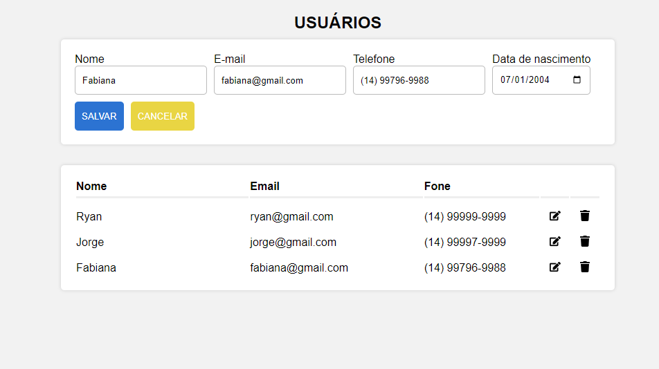

# CRUD React, Node e MySQL
___

___
This CRUD was developed with Node, React and MySQL.
To setup this project follow these steps:
- **Database**
    The project was developed with MySQL aat port 3306, user 'root' with password 'root' and running into localhost. If you are not running on this conditions, please edit the /api/db.js.
    There is also a dump of the database in the /database/
- **Node**
    Please run a 'npm install' at /api/ to install the dependencies and then run a 'npm start'. The project is running on port 8000. If you don't please edit the /api/index.js and /frontend/settings.js
- **React**
    Please run a 'npm install' at /frontend/ to install the dependencies and then run a 'npm start'. The project is running on port 3000
    